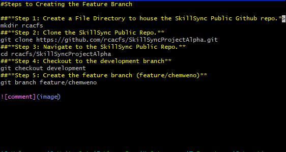

#Steps to Creating the Feature Branch

**Step 1: Create a File Directory to house the SkillSync Public Github repo.** 
```
mkdir rcacfs
```
**Step 2: Clone the SkillSync Public Repo.**
```
git clone https://github.com/rcacfs/SkillSyncProjectAlpha.git
```
**Step 3: Navigate to the SkillSync Public Repo.**
```
cd rcacfs/SkillSyncProjectAlpha
```
**Step 4: Checkout to the development branch**
```
git checkout development
```
**Step 5: Create the feature branch (feature/chemweno)**
```
git branch feature/chemweno
```

