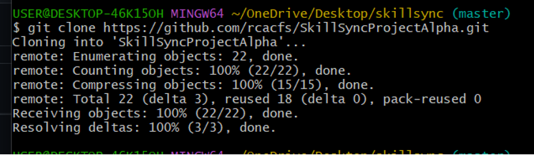
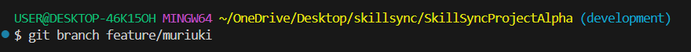
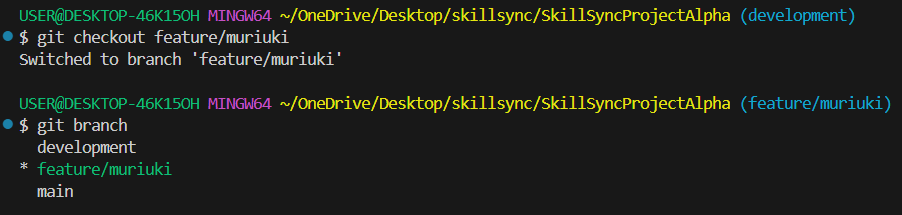

# **STEPS FOLLOWED TO CREATE MY FEATURE BRANCH**
## 1. Git clone the Skillsync public github repository
    - Navigated to directory to work in, in my case: skillsync
    - Used 'git clone' to copy the skillsync public github repository to my local machine
    ```git clone https://github.com/rcacfs/SkillSyncProjectAlpha.git```
    

## 2. Checkout to development branch
    - Navigated to the cloned repository directory
    ```
    cd SkillSyncProjectAlpha/
    ```
    - Checked the branch I was currently in which returned 'main'
    ```
    git branch
    ```
    - Checked out to the development branch
    ```
    git checkout development
    ```
    
## 3. Create a feature branch
    - Used the 'git branch' command to create a feature branch named feature/muriuki
    ```
    git branch feature/muriuki
    ```
    
## 4. Checkout to my feature branch
    - Checked out to the created feature branch
    ```
    git checkout feature/muriuki
    ```
    - Confirmed the current branch by running 'git branch'
    ```
    git branch
    ```
    

