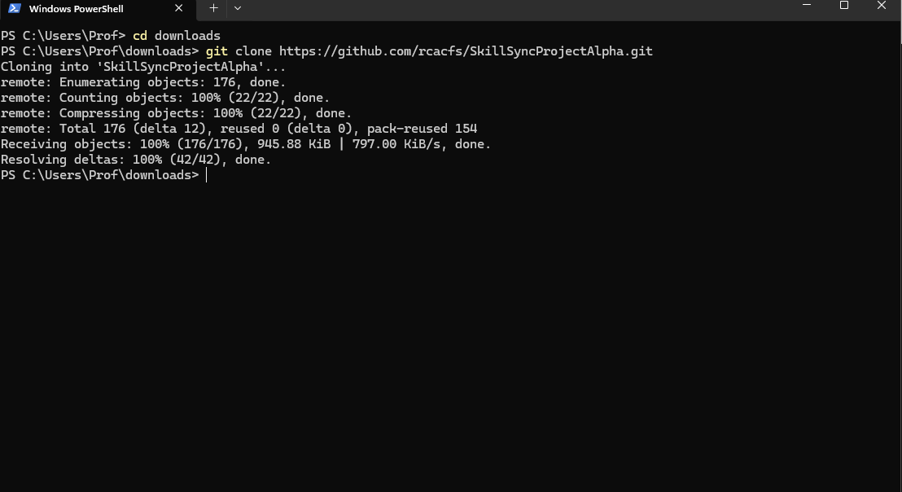
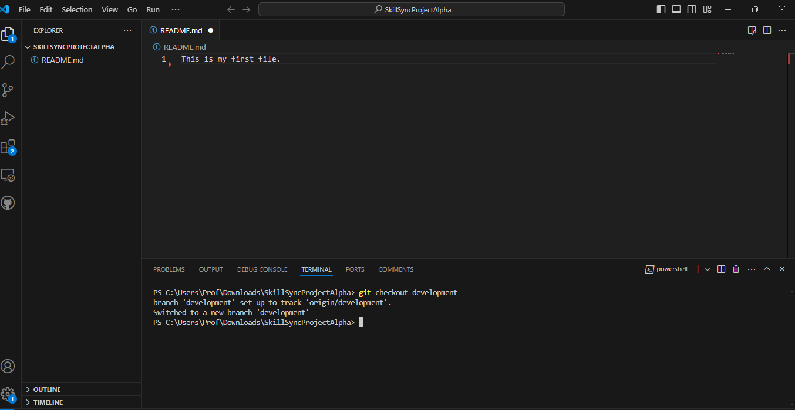

### Git clone
-The first step was to clone the skillsync public repository
```

git clone https://github.com/rcacfs/SkillSyncProjectAlpha.git
```



### Check out to development branch
```

git checkout feature/development
```


### create feature branch
```

git check out -b feature/stary
```


### create md file
```

touch sitati.md
```


